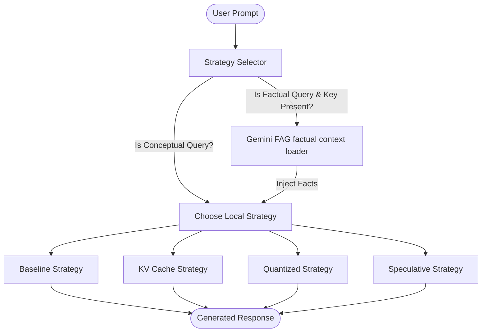

# Adaptive LLM Inference System

An optimized, adaptive inference engine for Large Language Models (LLMs) that dynamically routes student queries to the most efficient generation strategy based on query characteristics and system memory limits. The project also features a **Stealth Retrieval-Augmented Generation (RAG)** pipeline to fetch current, real-time facts using a cloud LLM, which are then summarized by your local GPU model.

Designed to run efficiently on resource-constrained hardware, such as a **Google Colab T4 GPU**, this system features a command-line interface (CLI) and an interactive Streamlit web dashboard.

---

## Key Features

1. **Adaptive Inference Routing**: Dynamically evaluates the complexity and length of incoming prompts to choose the most efficient strategy.
2. **Lazy Loading & Memory Recovery**: Models are loaded on demand and cached. Active models are automatically unloaded from memory (accompanied by VRAM cache flushes) when switching strategies, preventing Out-Of-Memory (OOM) errors.
3. **Stealth RAG (Factual Augmentation)**: Scans queries for real-time questions (e.g. current events, politicians, news). If detected, it uses the Google Gemini API to fetch bulleted facts in the background and injects them into the local model prompt.
4. **True Baseline vs. KV-Cache Benchmark**: KV-caching is disabled (`use_cache=False`) in the Baseline strategy to accurately measure and demonstrate the latency benefits of KV-caching.
5. **True Speculative Decoding**: Uses Hugging Face's built-in assistant generation. By default, it runs **Prompt Lookup speculative decoding** (using context matching), but can load a distinct helper model if configured.
6. **Secure Local Config (`.env`)**: Sensitive credentials like Gemini API keys are loaded locally from an ignored `.env` file, keeping them completely safe from public GitHub repositories.
7. **SSL Verification Override**: Contains built-in client factories to bypass certificate verification errors in corporate or restricted proxy networks.

---

## Architecture Overview



### The 4 Local Inference Strategies
* **Baseline**: Standard autoregressive text generation without caching. Best for very short queries when memory is clear.
* **KV Cache**: Accelerated generation using key-value state caching. Extremely fast for longer, complex queries.
* **Quantized**: 8-bit quantized model loading (`bitsandbytes`) to minimize memory footprints in ultra-low memory configurations.
* **Speculative**: Highly accelerated speculative decoding using prompt token lookups for faster response times.

---

## Directory Structure

```text
├── config/
│   ├── __init__.py
│   └── settings.py              # Main configurations (model names, tokens, memory limits)
├── controller/
│   ├── __init__.py
│   └── strategy_selector.py     # Adaptive routing logic and factual query detection
├── inference/
│   ├── __init__.py
│   ├── loader.py                # Lazy-loading getters & memory flushes
│   ├── baseline.py              # Local baseline generator (cache disabled)
│   ├── kv_cache.py              # Local KV-cache generator
│   ├── quantized.py             # Local quantized generator
│   ├── speculative.py           # Local speculative decoding generator
│   └── gemini_api.py            # Gemini factual context retriever
├── metrics/
│   ├── __init__.py
│   └── profiler.py              # Latency & memory tracking helpers
├── prompts/
│   ├── __init__.py
│   └── system_prompt.py         # Baseline system instructions for the LLM
├── results/
│   └── experiment_logs.csv      # Local csv file containing benchmark data
├── scratch/
│   └── test_gen.py              # Sandbox benchmarking test runner script
├── utils/
│   ├── __init__.py
│   └── text_formatter.py        # Cleans prompt formatting leaks from final answers
├── app.py                       # Streamlit web dashboard
├── main.py                      # Interactive CLI client
├── requirements.txt             # Project dependencies
└── .gitignore                   # Standard Python ignores including credentials
```

---

## Setup & Installation

### Local Machine Setup
1. Clone the repository:
   ```bash
   git clone https://github.com/joshi-006/adaptive-inference-llm.git
   cd adaptive-inference-llm
   ```
2. Install the required dependencies:
   ```bash
   pip install -r requirements.txt
   ```
3. *(Optional)* Setup your Gemini API key locally:
   Create a `.env` file in the root folder:
   ```env
   GEMINI_API_KEY=AIzaSyYourGeminiAPIKeyHere
   ```

---

### Google Colab GPU Setup (Recommended)
If you do not have a local GPU, you can run the dashboard with full **Tesla T4 GPU** acceleration on Google Colab and tunnel the interface back to your browser:

1. Open a new notebook on [Google Colab](https://colab.research.google.com/) and set the runtime to **T4 GPU** (Runtime -> Change runtime type).
2. Run this block in a single cell to clone and setup the environment:
   ```python
   !git clone https://github.com/joshi-006/adaptive-inference-llm.git
   %cd adaptive-inference-llm
   !pip install -r requirements.txt
   ```
3. Set your Gemini API key inside the Colab folder:
   ```python
   with open(".env", "w") as f:
       f.write("GEMINI_API_KEY=AIzaSy...your_gemini_key...")
   ```
4. Expose the server using **ngrok** (install `pyngrok` and paste your free authtoken from [dashboard.ngrok.com](https://dashboard.ngrok.com/)):
   ```python
   !pip install -q pyngrok
   from pyngrok import ngrok
   ngrok.set_auth_token("YOUR_NGROK_AUTH_TOKEN")
   public_url = ngrok.connect(8501, proto="http")
   print("\n🔗 Open Streamlit App here:", public_url.public_url)
   ```
5. Run the Streamlit server in the background:
   ```python
   !nohup streamlit run app.py --server.port 8501 --server.address 0.0.0.0 --server.enableCORS=false --server.enableXsrfProtection=false > streamlit.log 2>&1 &
   ```

---

## How to Run & Use

### Interactive Streamlit Dashboard
Launch the web-based graphical interface:
```bash
streamlit run app.py
```
* **Factual Augmentation**: Ask a factual question (e.g. *"Who is the current prime minister of India?"*). The status card will show *"🔍 Retrieving factual context..."*, and the metadata block at the bottom will display **`Strategy: speculative (Factual Augmented)`**.
* **Concept Generation**: Ask an educational question (e.g. *"Explain osmosis"*). The model will generate the response locally, bypassing the cloud API, and display **`Strategy: kv_cache`** or **`speculative`**.

### Command Line Interface (CLI)
For a terminal-based interface:
```bash
python main.py
```
The CLI works identically to the dashboard, dynamically selecting strategies, running background context retrievals, and printing detailed latency metrics for each turn.
