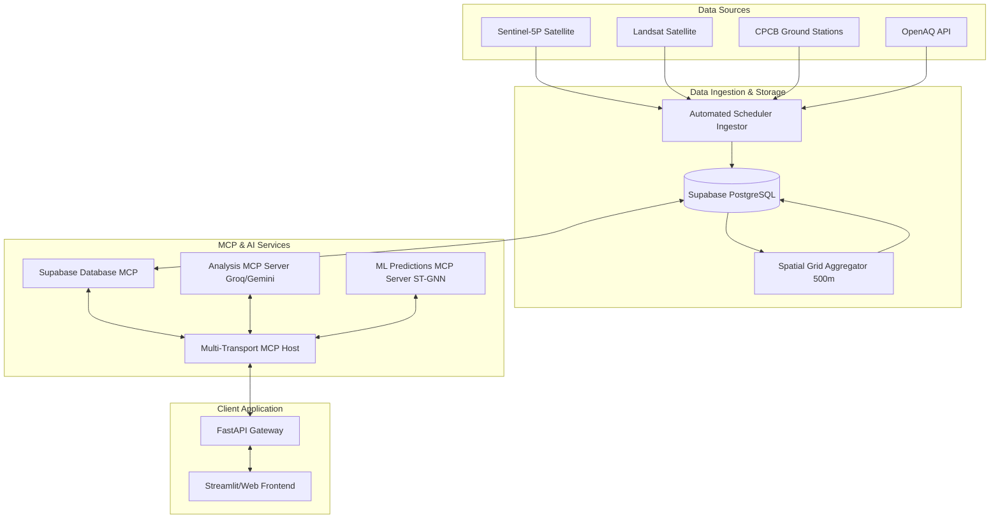

# PodScout Pro: AI-Powered Spatial Air Pollution Monitoring & Intervention Platform

PodScout Pro is a state-of-the-art, end-to-end air quality analysis, spatial grid aggregation, predictive forecasting (using ST-GNN models), and real-time alert dispatch platform. The system ingests data from Earth observation satellites and ground stations, processes it into high-resolution spatial grids, and utilizes Model Context Protocol (MCP) servers to expose AI analysis and forecasting tools.

---

## 🎯 Core Capabilities

### 1. Spatial Grid & Data Ingestion Pipeline
* **Multi-Source Data Ingestor**: Connects to **Sentinel-5P** (satellite imagery), **Landsat**, **CPCB** (Central Pollution Control Board of India), and **OpenAQ**.
* **Adaptive Spatial Grids**: Computes cell metrics at **500m, 1km, and 2km** scales for major metropolitan areas.
* **Aggregated Feature Vectors**: Builds 14-dimensional feature vectors per grid cell, combining atmospheric pollution measurements with demographic and geographical variables.

### 2. Machine Learning Forecasting
* **Spatio-Temporal Graph Neural Networks (ST-GNN)**: Utilizes a GCN + LSTM model to capture spatial dependencies and temporal trends.
* **Graph Builders**: Builds dynamic adjacency matrices representing geographic neighborhood relations of spatial grid cells.

### 3. Model Context Protocol (MCP) Architecture
Exposes system capabilities through three distinct MCP servers running over stdio & SSE:
1. **Analysis MCP Server**: Conducts AI-driven air quality assessments using large language models (Mixtral/Gemini).
2. **ML Predictions MCP Server**: Serves forecasting predictions using trained ST-GNN models.
3. **Supabase MCP Server**: Manages data querying, schema management, and storage synchronization.

### 4. Alerting & Intervention Channels
* **SMS & WhatsApp Dispatch**: Twilio integration for instant push alerts.
* **Email Broadcast**: SendGrid integration for detailed intervention updates.
* **Slack Webhooks**: Publishes immediate alert summaries directly to workspace channels.

---

## 📊 System Architecture



---

## 📁 Repository Structure

```text
├── backend/
│   └── app/
│       ├── agents/        # LangChain/LLM Agent configuration
│       ├── alerts/        # Twilio, SendGrid, and Webhook dispatch logic
│       ├── api/           # FastAPI endpoints
│       ├── core/          # Main application orchestration & DB connections
│       ├── ingestion/     # Satellite (EE/Sentinel) & CPCB ground ingestion scripts
│       ├── llm/           # Groq and Gemini clients
│       ├── mcp_host/      # Model Context Protocol SSE/stdio host
│       ├── ml/            # ST-GNN model files & graph builders
│       ├── services/      # Grid and pipeline business logic
│       ├── spatial/       # Major cities coordinates and cell indexing
│       ├── main.py        # Main FastAPI system entry point
│       └── config.py      # App configurations & environment parsing
├── database/
│   ├── schema.sql         # Base tables definition
│   └── grid_cells_schema.sql # Spatial grid tables definition
├── workers/               # Async task worker setups
├── docs/                  # Detailed design and API docs
├── tests/                 # Unit & integration suite
├── QUICKSTART.md          # Setup cheatsheet
├── SETUP_REAL_DATA.md     # Sentinel & CPCB GEE integration guide
└── pyproject.toml         # Python dependency configurations
```

---

## 🔑 Environment Variables Configuration

Copy `.env.example` to `.env` and fill in the required keys:

```bash
cp .env.example .env
```

| Environment Variable | Description |
|---|---|
| `SUPABASE_URL` & `SUPABASE_KEY` | Database storage credentials |
| `GROQ_API_KEY` | Groq API access token (default model: `mixtral-8x7b-32768`) |
| `GEMINI_API_KEY` | Google Gemini API key (default model: `gemini-2.0-flash-exp`) |
| `GEE_SERVICE_ACCOUNT` & `GEE_PRIVATE_KEY_PATH` | Google Earth Engine auth details |
| `TWILIO_ACCOUNT_SID` & `TWILIO_AUTH_TOKEN` | SMS / WhatsApp notification keys |
| `SENDGRID_API_KEY` | Email notification key |

---

## 🚀 Getting Started

### 1. Database Initialization
Create your project on Supabase and execute the following SQL scripts in the **SQL Editor**:
1. Run [database/schema.sql](file:///c:/Users/njosh/Desktop/inkaperuemianukole/database/schema.sql) to initialize core tables.
2. Run [database/grid_cells_schema.sql](file:///c:/Users/njosh/Desktop/inkaperuemianukole/database/grid_cells_schema.sql) to set up spatial cells.

### 2. Start the Backend
Execute using `uv` (or `python` in a virtual environment):
```bash
uv run python -m backend.app.main
```
Upon startup, the FastAPI app automatically connects to the `analysis`, `ml_predictions`, and `supabase` MCP servers and schedules the hourly background ingestion worker.

### 3. Generate Spatial Grids
Generate spatial grid cells for major target cities (Delhi, Mumbai, Bangalore, Chennai, Kolkata):
```bash
curl -X POST http://localhost:8000/api/v1/spatial/grid/generate/major-cities
```

### 4. Verify System Integrity
Run the built-in system verification suite:
```bash
python verify_system.py
```
This tests:
* Backend health and routing endpoints.
* Successful handshake with the 3 MCP servers.
* Database connections.
* Real-time pipeline state.
* AI Analysis (via Groq/Gemini) & ML Prediction model outputs.
