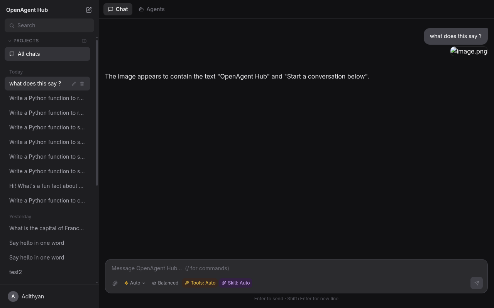
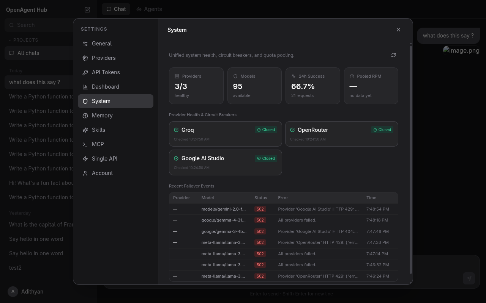
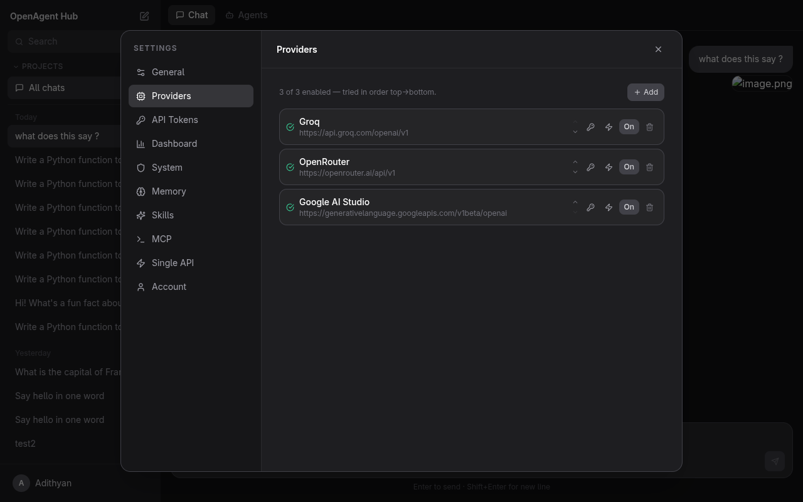
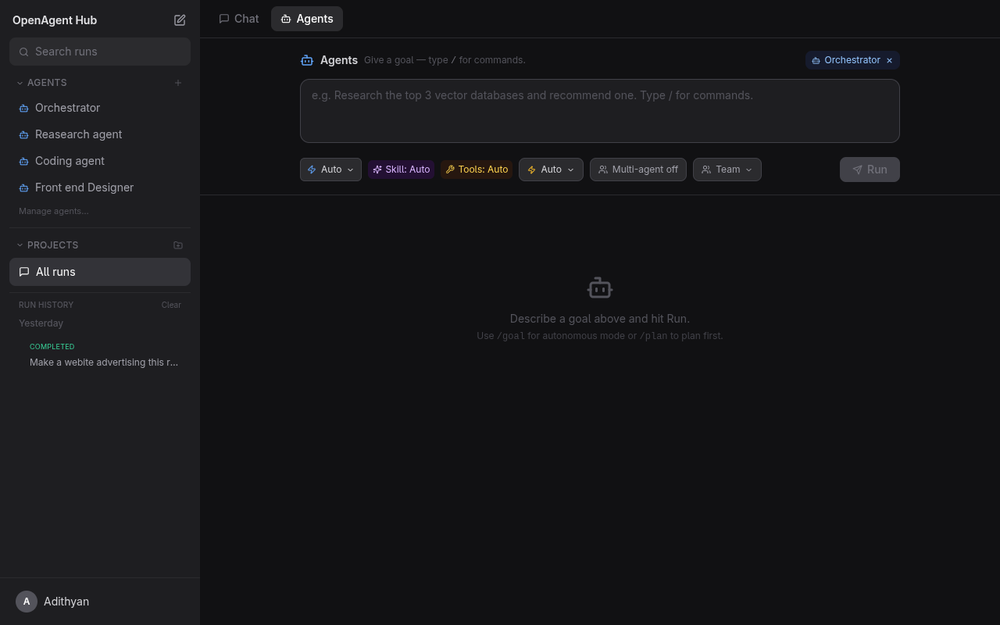

<p align="center">
  
</p>

<h1 align="center">OpenAgent Hub</h1>

<p align="center">
  <strong>A self-hosted AI operating system that unifies LLM providers, models, agents, tools, and memory into one platform.</strong>
</p>

<p align="center">
  Connect Groq, OpenRouter, Google AI Studio, Mistral, NVIDIA NIM, and 15+ more providers.<br/>
  Route to the best free model for each task. Failover automatically. Zero cost.
</p>

<p align="center">
  
  
  
  
  
</p>

---

## Screenshots

| Chat | System Health |
|:---:|:---:|
|  |  |

| Providers | Agents |
|:---:|:---:|
|  |  |

---

## Quick Start

**Prerequisites:** Docker and Docker Compose.

```bash
git clone https://github.com/AdithyanandanArun/openagent-hub.git
cd openagent-hub
docker compose up -d --build
```

Open [http://localhost:3000](http://localhost:3000), register an account, and add your first provider.

> Frontend runs on port **3000**, backend API on port **8000**.

---

## Features

### Chat & Workspace

- ChatGPT-style conversations with streaming, markdown, code highlighting (Prism), and KaTeX math
- Projects to organize conversations
- Message editing and regeneration
- File and image attachments with clipboard paste support
- Image vision — pasted/attached images are sent to vision-capable models via base64 encoding

### Multi-Provider Engine

- **20 provider presets** — one-click setup for Groq, OpenRouter, Google AI Studio, Mistral, NVIDIA NIM, Cohere, Cerebras, GitHub Models, HuggingFace, Cloudflare Workers AI, SambaNova, OVHcloud, DeepInfra, and more
- **Any OpenAI-compatible endpoint** works as a custom provider
- **Free-only model catalog** — paid models are automatically filtered out using provider-specific rules
- **170+ model families** classified with speed, coding, knowledge, vision, and reasoning scores
- **Grouped model picker** with capability badges (vision, reasoning, fast, context window)

### Intelligent Routing

- **Auto mode** — analyzes your message to detect coding, reasoning, vision, or long-context needs, then picks the best free model
- **4 routing modes:**
  - **Balanced** — smart task-aware routing (default)
  - **Speed** — fastest response time, picks flash/mini models
  - **Quality** — best knowledge and reasoning, picks pro/large models
  - **Reliability** — proven uptime from your actual request history
- **Reliability tracking** — aggregates success rates, latency, and error rates per model

### Circuit Breaker Failover

- **DB-persisted circuit breakers** with three states: closed, open, half-open
- **Exponential backoff** — 60s → 120s → 240s → 480s → 600s max cooldown
- **Error classification** — retryable (429, 500, 502, 503, 504) vs non-retryable (400, 401, 403, 404)
- **Automatic recovery** — health probes reset circuit breakers when providers come back online
- **Quota pooling** — tracks upstream `x-ratelimit-*` headers for RPM/TPM awareness

### Intelligence Layer

- **Memory** — persistent user, project, and conversation memory injected into chats and agent runs
- **Agent framework** — give a goal; the agent plans, calls tools in a ReAct loop, and streams a live timeline
- **Multi-agent** — coordinator agents spawn sub-agents that run in parallel and share memory
- **Tools** — built-in (calculate, memory, time) plus any tool from connected MCP servers
- **MCP integration** — register stdio MCP servers for dynamic tool discovery
- **Skills** — reusable instruction sets (Code Review, Research, Documentation, Refactoring, Testing, + custom)

### System Dashboard

- Unified health overview: providers, models, 24h success rate, pooled RPM
- Per-provider circuit breaker state, failure counts, cooldown timers
- RPM/TPM quota gauges with color-coded bars
- Failover event log with status codes and error details

### Platform

- JWT authentication with API token management
- Request logging and analytics with latency tracking
- OpenAI-compatible `/v1/chat/completions` API for external tool integration
- Light and dark theme
- Fully self-hosted with Docker Compose

---

## Supported Free Providers

| Provider | Free Tier | Notes |
|----------|-----------|-------|
| **Groq** | All models free | Per-model rate limits, no card required |
| **Google AI Studio** | All models free | Gemini 2.5/3.x, per-project limits |
| **OpenRouter** | `:free` suffix models | ~20 RPM / 200 RPD |
| **Mistral** | All models free | Experiment plan, phone-verified |
| **NVIDIA NIM** | Dev credits + free models | Key starts with `nvapi-` |
| **Cohere** | 1000 calls/mo trial | Non-commercial, all models |
| **Cerebras** | ~1M tokens/day | No card, 8K context cap |
| **GitHub Models** | All models free | PAT with `models:read` scope |
| **Cloudflare Workers AI** | 10K Neurons/day | Requires Account ID |
| **SambaNova** | 200K TPD | No card, fast inference |
| **OVHcloud** | 2 RPM/model | Anonymous, EU-hosted |
| **DeepInfra** | Free serverless tier | Selected open-weight models |

---

## Adding Providers

1. Click your username → **Settings** → **Providers**
2. Click **Add** (or use a quick-add preset)
3. Enter a name, base URL, and API key
4. Click **Test** to verify — only free models are synced
5. Models from all enabled providers appear in the model picker

---

## Using Agents

1. Switch to the **Agents** tab
2. Type a goal, optionally pick a **Skill** and toggle **Multi-agent**, then **Run**
3. Watch the live timeline: thoughts, tool calls, tool results, and the final answer
4. Past runs are saved in the **Run history** panel

### Memory, Skills & MCP

- **Memory** (Settings → Memory) — facts injected into every chat and agent run
- **Skills** (Settings → Skills) — five built-in + custom instruction sets
- **MCP** (Settings → MCP) — register stdio MCP servers for additional agent tools

---

## Tech Stack

| Layer | Technology |
|-------|------------|
| **Backend** | FastAPI, SQLAlchemy 2.0, Alembic, PostgreSQL |
| **Frontend** | React 18, TypeScript, Vite, Tailwind CSS |
| **Rendering** | react-markdown, remark-gfm, KaTeX, Prism |
| **Auth** | JWT (python-jose), bcrypt |
| **Serving** | nginx (frontend), uvicorn (backend) |
| **Runtime** | Docker Compose |

---

## Project Structure

```
openagent-hub/
├── backend/
│   ├── app/
│   │   ├── api/            # FastAPI route handlers
│   │   ├── models/         # SQLAlchemy ORM models
│   │   ├── schemas/        # Pydantic request/response schemas
│   │   ├── services/       # Business logic (routing, failover, taxonomy)
│   │   └── main.py
│   ├── migrations/         # Alembic migrations (001–013)
│   └── requirements.txt
├── frontend/
│   ├── src/
│   │   ├── components/     # React components
│   │   ├── hooks/          # Custom React hooks
│   │   ├── pages/          # Page components
│   │   └── services/       # API client functions
│   └── package.json
├── docker-compose.yml
└── README.md
```

---

## Architecture

All 12 phases of the system are complete:

| Phase | Description |
|:-----:|-------------|
| **1** | Foundation — auth, conversations, streaming chat, markdown rendering |
| **2** | Production UX — attachments, message editing, projects, themes |
| **3** | Multi-Provider — provider registry, dynamic models, routing, failover |
| **4** | Unified Model Layer — model catalog with capability metadata |
| **5** | Memory System — user, project, and conversation memory |
| **6** | Agent Framework — autonomous execution, task planning, tool calls |
| **7** | MCP Integration — stdio MCP servers, dynamic tool discovery |
| **8** | Multi-Agent — sub-agents, parallel execution, shared memory |
| **9** | Skills System — reusable composable agent capabilities |
| **10** | Intelligent Routing — model taxonomy, 4 routing modes, free-only catalog |
| **11** | Automatic Failover — circuit breakers, exponential backoff, error classification |
| **12** | AI Operating System — unified system dashboard, quota pooling, health monitoring |

---

## Development

Run with live reload (backend mounts `./backend` as a volume):

```bash
docker compose up
```

Backend API: `http://localhost:8000` — Interactive docs: `http://localhost:8000/docs`

Rebuild frontend only:

```bash
docker compose up -d --build frontend
```

---

## License

MIT
