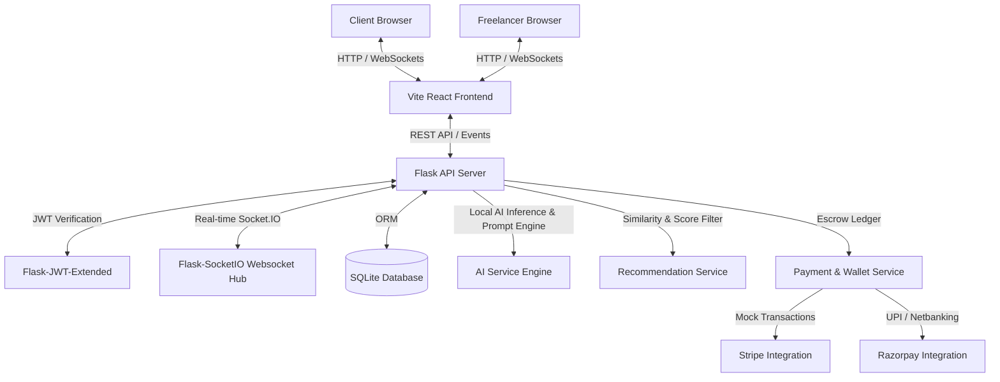
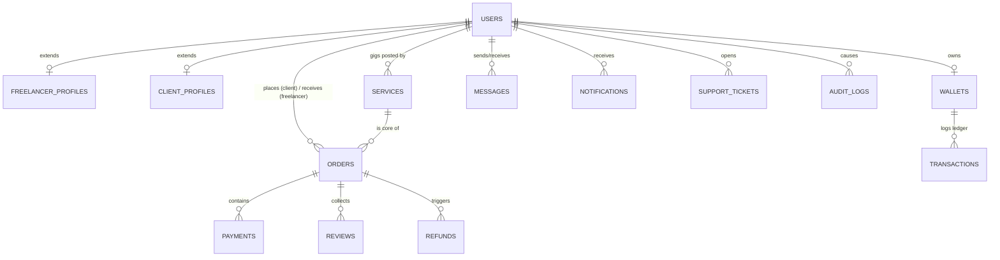

# 🚀 SkillBridge AI — AI-Powered Freelance Marketplace

**SkillBridge AI** is an advanced, full-stack freelance marketplace that combines traditional marketplace features (escrow-based payments, gig listings, direct client-freelancer contracting) with powerful, integrated AI services (ATS Resume Analysis, Smart Collaborative Matching, and automated AI Support Assistants). The platform supports real-time dual communication channels via WebSockets, multi-method payment gates, and secure, double-entry ledger audits.

---

## 🗺️ System Architecture



---

## ✨ Core Features

### 🧠 AI-Powered Capabilities
*   **ATS Resume Analyzer**: Features a rule-based semantic parser that evaluates freelancer resume uploads against target roles, calculates an ATS match score (out of 100), identifies missing key skills, and provides structured suggestions for improvements. Refer to [ai_service.py](file:///c:/Users/mohit/Documents/AI-Powered%20Freelance%20Marketsplace/backend/services/ai_service.py).
*   **AI Support Assistant Chatbot**: Integrated support chatbot that handles queries in real-time. It retrieves live order status, answers platform fee/escrow queries, and provides automated dispute/refund resolution options.
*   **Smart Recommendation Engine**: Recommends personalized gigs/services by combining client transaction histories, service category trends, and freelancer ratings. See [recommendation.py](file:///c:/Users/mohit/Documents/AI-Powered%20Freelance%20Marketsplace/backend/services/recommendation.py).

### 💬 Real-Time Communication Hub
*   **Persistent Chat & Rooms**: Dual-channel communication via Socket.IO. Enables clients and freelancers to join custom messaging rooms (`room_id`), share text or attachment links, and track read/unread markers.
*   **Typing Indicators & Active Alerts**: Interactive UI animations for "Typing..." states and immediate system notification dispatches whenever an order milestone updates.

### 💳 Escrow-Based Payment System
*   **Secure Escrow Ledgers**: Client funds are held in secure escrow upon ordering. Once the freelancer delivers and the client approves, funds are transferred to the freelancer's wallet.
*   **Instant Refund Protocols**: Admin-mediated dispute handling automatically triggers transactions back into client wallets.
*   **Dual Payments Support**: Supports Stripe (Credit Cards) and Razorpay (UPI, Netbanking) mock integrations, with all transactions audited in a central ledger.

---

## 📁 Repository Structure

```text
AI-Powered Freelance Marketplace/
├── backend/                   # Python Flask backend
│   ├── models/                # SQLAlchemy database models
│   ├── routes/                # Flask blueprints (Auth, Orders, Admin, Wallet)
│   ├── services/              # Business logic (AI, Escrow, Recommendations)
│   ├── utils/                 # Utility helpers
│   ├── middleware/            # JWT and CORS middleware
│   ├── app.py                 # Flask entry point and Socket.IO hub
│   ├── config.py              # Configuration & Environment loading
│   └── requirements.txt       # Backend package dependencies
├── frontend/                  # Vite + React frontend
│   ├── src/
│   │   ├── components/        # Reusable UI elements (Navbar, Cards, Globe)
│   │   ├── pages/             # Route views (Home, Wallet, Orders, Messages)
│   │   ├── context/           # React Global Contexts (Auth, Socket)
│   │   ├── App.jsx            # Main app router & layout
│   │   └── main.jsx           # App initialization
│   ├── package.json           # Frontend scripts & dependencies
│   ├── tailwind.config.js     # Tailwind CSS styling configuration
│   └── vite.config.js         # Vite dev configuration
├── database/                  # Database scripts and assets
│   ├── schema.sql             # Full DDL database schema definitions
│   ├── seed.sql               # Seed data (prepopulated users, gigs, audits)
│   └── skillbridge.db         # Local SQLite DB
└── requirements.txt           # Consolidated pip requirements
```

---

## 🗄️ Database Schema (ERD)



---

## 🚀 Getting Started

### Prerequisites
*   **Python 3.8+**
*   **Node.js 18+** & **npm**

### Step 1: Clone and Configure Environment
Copy and populate `.env` in the root directory:
```bash
# Database & Secrets
SECRET_KEY=your_flask_secret_key
JWT_SECRET_KEY=your_jwt_secret_key
DATABASE_URL=sqlite:///database/skillbridge.db

# API Integrations (Optional)
OPENAI_API_KEY=
GEMINI_API_KEY=
STRIPE_PUBLIC_KEY=pk_test_...
STRIPE_SECRET_KEY=sk_test_...
RAZORPAY_KEY_ID=rzp_test_...
RAZORPAY_KEY_SECRET=rzp_test_...
```

### Step 2: Set Up Python Backend
1.  Navigate to the project root and activate the virtual environment:
    ```powershell
    # Windows PowerShell
    .\venv\Scripts\Activate.ps1
    ```
2.  Install dependencies:
    ```bash
    pip install -r backend/requirements.txt
    ```
3.  Seed the Database:
    The database initializes and seeds itself automatically using [seed.sql](file:///c:/Users/mohit/Documents/AI-Powered%20Freelance%20Marketsplace/database/seed.sql) on the first run of the application if `skillbridge.db` is empty or missing.
4.  Run the Flask API Server:
    ```bash
    python -m backend.app
    ```
    *The backend will boot on http://localhost:5000.*

### Step 3: Set Up Vite Frontend
1.  Navigate into the `frontend` directory:
    ```bash
    cd frontend
    ```
2.  Install npm packages:
    ```bash
    npm install
    ```
3.  Run the Vite development server:
    ```bash
    npm run dev
    ```
    *Open http://localhost:5173 in your browser to view the application.*

---

## 🔌 API & Socket.IO Reference

### Rest Endpoints
| Endpoint | Method | Description |
| :--- | :--- | :--- |
| `/api/auth/register` | `POST` | Create a new user client or freelancer profile |
| `/api/auth/login` | `POST` | Authenticate user and receive JWT bearer tokens |
| `/api/services` | `GET` / `POST` | Query active listings / Create new freelance services |
| `/api/orders` | `POST` / `GET` | Create order escrow / Fetch user order lists |
| `/api/payments/charge` | `POST` | Initiate payment charges using Stripe/Razorpay |
| `/api/wallet/balance` | `GET` | Retrieve wallet balance & statement history |
| `/api/admin/audit` | `GET` | Retrieve system actions and audit log list (Admins only) |

### WebSocket Events (Socket.IO)
*   `connect`: Initiates connection from client to backend.
*   `join` (Payload: `{ room }`): Connects client to a direct message channel or user-specific notification stream.
*   `leave` (Payload: `{ room }`): Detaches listener from the room.
*   `message` (Payload: `{ sender_id, receiver_id, content, room, file_url }`): Distributes live message inside the room and schedules a push notification.
*   `typing` (Payload: `{ room, user_id, is_typing }`): Broadcasts user typing indicator animations.

---

## 📄 License & Integrity
This repository complies with strict professional software engineering practices. All existing licensing controls, standard database interfaces, and security authorization schemes are strictly enforced. All code comments and documentation headers remain untouched to preserve developer context.
